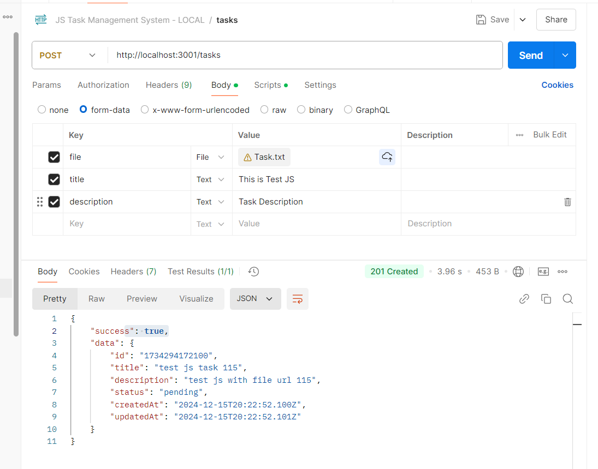
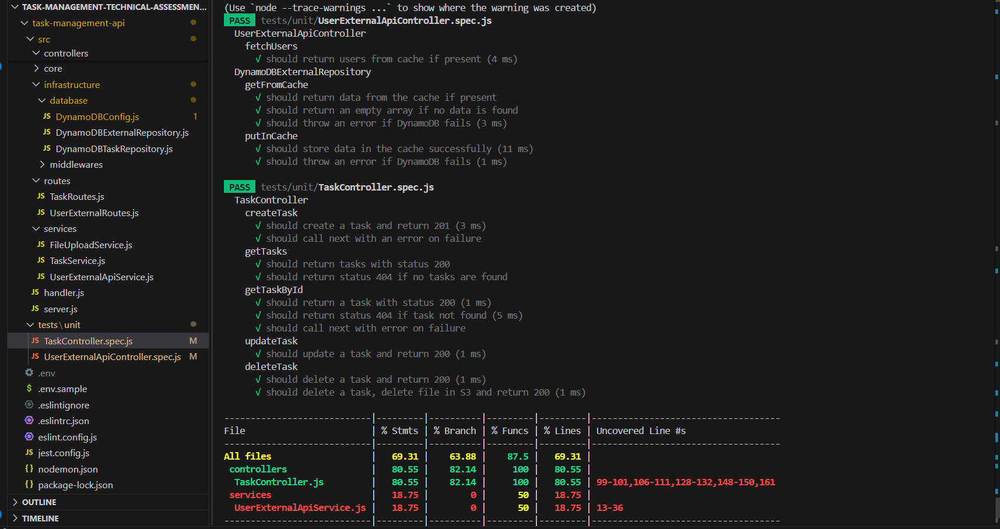
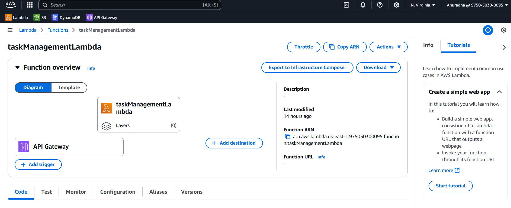
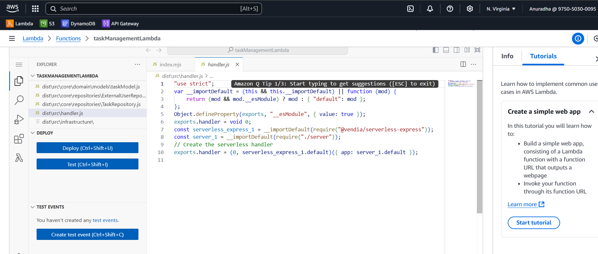
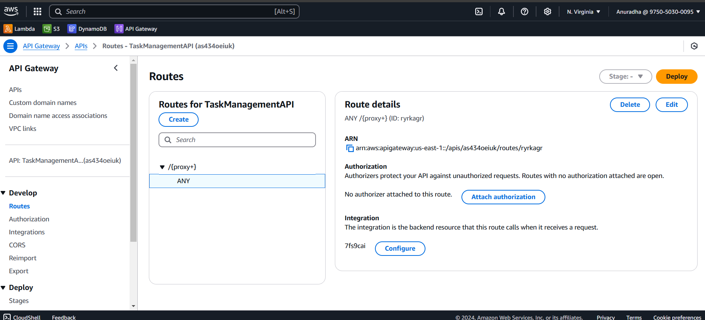

# Task Management System API Javascript

Built using **Express.js** and **Node.js** (JavaScript, ES6 compliant), it adheres to **Hexagonal Architecture** and **SOLID principles** to ensure maintainability and extensibility.

---

## Requirements

To run this project locally, ensure you have the following installed:

- **Node.js**: v18 or higher
- **npm** or **Yarn**: Latest version
- **JavaScript**: Ensure Node.js (ES6 compliant) is installed globally if running the API outside of this project.

## Features

- **Task Management**: Create, read, update, and delete tasks with fields like UUID, title, description, status, and timestamps.
- **Scalability**: Designed using microservices to handle high traffic and concurrent requests.
- **AWS Integration**: Stores files in S3, caches data using DynamoDB with TTL.
- **Robust Validation**: Implements input validation and error handling.
- **Extensibility**: Follows Hexagonal Architecture principles for easily adding new features.

---

## Technologies Used

- **Backend**: Node.js (Express.js, JavaScript)
- **Database**: DynamoDB
- **Caching**: DynamoDB with TTL
- **Storage**: AWS S3
- **Architecture**: Hexagonal Architecture, SOLID principles
- **Cloud Services**: AWS SDK v3

---

## Project Structure

- **controllers/**: Contains business logic.
- **core/repositories**: Contains task and external api repositories.
- **core/domain**: Contains task entities.
- **services/**: Implements application-level services.
- **infrastructure/database**: Manages database connections and operations.
- **infrastructure/middlewares**: Custom middlewares for request error handling and validation.
- **routes**: Defines the API endpoints and controllers.
- **tests**: unit testing
- **config**: Defines environment variables

## Endpoints

### Task Endpoints

| Method | Endpoint     | Description              |
| ------ | ------------ | ------------------------ |
| POST   | `/tasks`     | Create a new task        |
| GET    | `/tasks`     | Retrieve all tasks       |
| GET    | `/tasks/:id` | Retrieve a specific task |
| PUT    | `/tasks/:id` | Update an existing task  |
| DELETE | `/tasks/:id` | Delete a task            |

---



## Installation

1. Clone the repository:

   ```bash
   git clone git@github.com:anudissanayake/task-management-assessment-javascript.git
   cd .\task-management-assessment-javascript\task-management-api\

   ```

2. Install dependencies:

   ```
   npm install
   ```

3. Set up environment variables:

   - copy setup variable from .env.sample to new task-management-api\ .env file
   - Configure `AWS_ACCESS_KEY_ID` and `AWS_SECRET_ACCESS_KEY`

4. Run the development server:

   ```
   npm run dev
   ```

5. Run the test:

   ```
   npm test
   ```

   Testing Framework: **Jest**

   Test Coverage:

   - Controllers: Validates the behavior of HTTP handlers.
   - Services: Ensures business logic and interactions with the data layer.
   - File Operations: Tests file upload and deletion functionality.

   The tests are structured to:

   - Mock Dependencies: External services and database operations are mocked using jest.mock.
   - Validate Edge Cases: Handles both success and failure scenarios.
   - Isolate Logic: Each unit of code is tested independently.

   

## Deployment

This project is deployed using **AWS Lambda** and **API Gateway** to ensure a serverless architecture.






